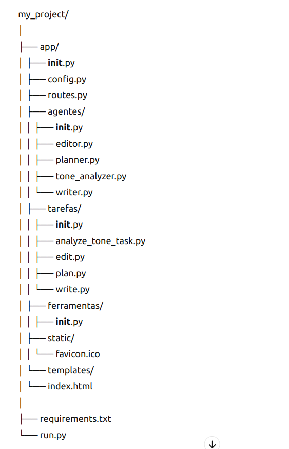

# CrewAI Blog Creator

Este projeto é uma aplicação web que utiliza a biblioteca CrewAI para criar e analisar conteúdo de blog. A aplicação permite que os usuários insiram um tópico e postagens opcionais, e então utiliza agentes de IA para planejar, escrever, editar e analisar o tom das postagens do blog.

## Estrutura do Diretório

A estrutura do diretório do projeto é a seguinte:
 

 

## Finalidade dos Arquivos

### Diretório `app/`

Contém a lógica principal da aplicação, incluindo a configuração do Flask, as rotas, agentes, tarefas e ferramentas.

- **`__init__.py`**: Arquivo de inicialização da aplicação Flask. Contém a função `create_app()` que configura e retorna a aplicação Flask.
- **`config.py`**: Contém as configurações da aplicação, incluindo as chaves da API e outras variáveis de configuração.
- **`routes.py`**: Define as rotas da aplicação. Inclui a rota principal para renderizar a página inicial e a rota `/api/kickoff` para iniciar o processo de criação do blog utilizando os agentes.

### Diretório `app/agentes/`

Contém os arquivos para cada agente utilizado na aplicação.

- **`editor.py`**: Define o agente editor.
- **`planner.py`**: Define o agente planejador.
- **`tone_analyzer.py`**: Define o agente analisador de tom.
- **`writer.py`**: Define o agente escritor.

### Diretório `app/tarefas/`

Contém os arquivos para cada tarefa utilizada na aplicação.

- **`analyze_tone_task.py`**: Define a tarefa de análise de tom.
- **`edit.py`**: Define a tarefa de edição.
- **`plan.py`**: Define a tarefa de planejamento.
- **`write.py`**: Define a tarefa de escrita.

### Diretório `app/ferramentas/`

Contém as ferramentas adicionais utilizadas pelos agentes, se houver.

### Diretório `app/static/`

Contém arquivos estáticos, como o favicon.

### Diretório `app/templates/`

Contém os templates HTML para a aplicação.

- **`index.html`**: Template principal da aplicação. Inclui o formulário para entrada de dados do usuário e exibe os resultados gerados pelos agentes.

### Arquivo `requirements.txt`

Lista as dependências da aplicação que precisam ser instaladas. Inclui Flask, Flask-CORS e CrewAI.

### Arquivo `run.py`

Ponto de entrada para executar a aplicação Flask. Importa a função `create_app` e inicia o servidor Flask.

## Como Executar a Aplicação

1. **Instalar as dependências**:
   Execute o comando:
   ```bash
   pip install -r requirements.txt

2. **Configurar as variáveis de ambiente:**
- Defina as chaves da API no ambiente.

3. **Executar o servidor Flask:**
- Execute:

python run.py

4. **Abrir o frontend:**
- Abra o navegador e vá para http://127.0.0.1:5000. Preencha o formulário e veja os resultados.
